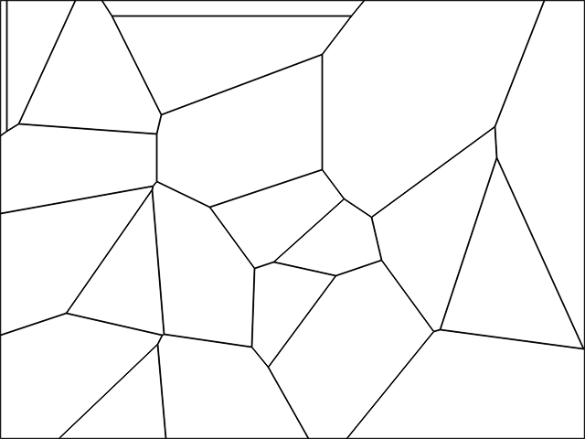
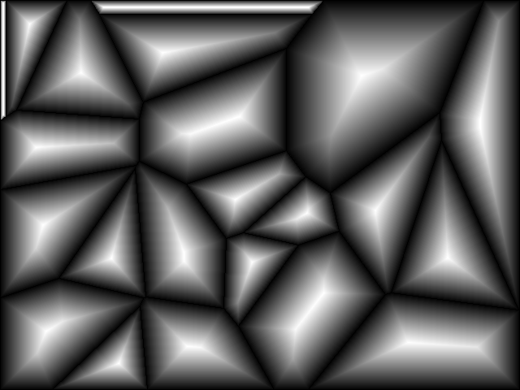
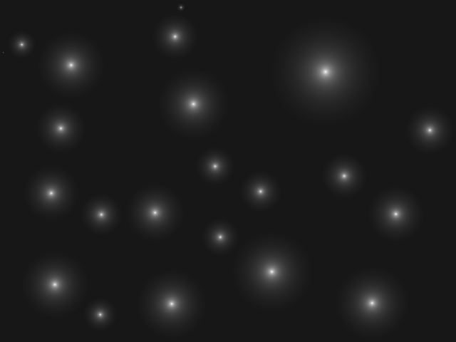
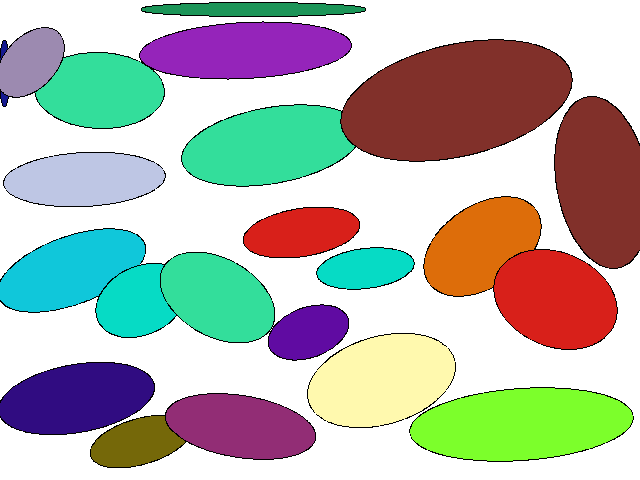

# EllipssianNet

## 0. Pre-Requisite
- pytorch
- cv2
- numpy
- skimage.feature
- PIL
- tqdm

---

## 1. Create Dataset
``` python create_dataset.py ```
<div align="center">

<table>
  <tr>
    <td align="center"></td>
    <td align="center"></td>
  </tr>
  <tr>
    <td align="center">Voronoi diagram (used as GT)</td>
    <td align="center">Edges of the diagram</td>
  </tr>
</table>
</div>


<div align="center">
<table>
  <tr>
    <td align="center"></td>
    <td align="center"></td>
    <td align="center"></td>
  </tr>
  <tr>
    <td align="center">Gradient map (used as GT)</td>
    <td align="center">Center probability map (used as GT)</td>
    <td align="center">Rendered Ellipssians</td>
  </tr>
</table>
</div>


### 1.1 Basic parameters
 - --batch 
   - Number of dataset to be created (100 by default)
   - ``python create_dataset.py --batch 200 ``  
 - --render 
   - Visualize(or not) the created dataset (True by default)
   - ``python create_dataset.py --render True ``  
   - ``python create_dataset.py --render False ``  
 - --save_path
   - Path to store the created dataset (Blank by default - does not save) 
   - ``python create_dataset.py --save_path "C:/your_path" `` 
### 1.2 Batch command parameters
 - --iteration
   - Considers the code is running with nth iteration (0 by default)
   - Indices of dataset are computed with this parameter.
 - --begin_batch
   - Beginning index number (0 by default)  

### 1.3 Usage in .bat file
 - The following command runs the code 10 (0-9) iterations. In total, dataset size of 2000 is to be created.
   ```
   for /l %%x in (0, 1, 9) do (
      set /a iter=%%x+1
      echo Running iteration !iter!/3
      python create_dataset.py --iteration %%x --batch 200
   )
   ```

 - The following command creates dataset size of 190 (200 - 10), beginning with 10, ending with 199.
    ```
       python create_dataset.py --batch 200 --begin_batch 10
    ```
---
### 1.4 For whom may be curious
 - The following command creates dataset size of 1900 ((200 - 10) * 10).
 - The indices of dataset will be 10-199, 210-399, 410-599, etc. 
   ```
   for /l %%x in (0, 1, 9) do (
      set /a iter=%%x+1
      echo Running iteration !iter!/3
      python create_dataset.py --iteration %%x --batch 200 --begin_batch 10
   )
   ```
   
---

## 2. Train
``` python train.py ```

### 2.1 Parameters
 - --dataset_path 
   - Path of dataset which include folders, "voronoi", "gradient", "center" and "cov"
   - ``python train.py --dataset_path "C:/your_path" ``  

---

## 3. Run (Inference)
``` python run.py ```

### 3.1 Parameters
 - --img_path 
   - Path of input image
   - ``python train.py --img_path "C:/your_path" ``  